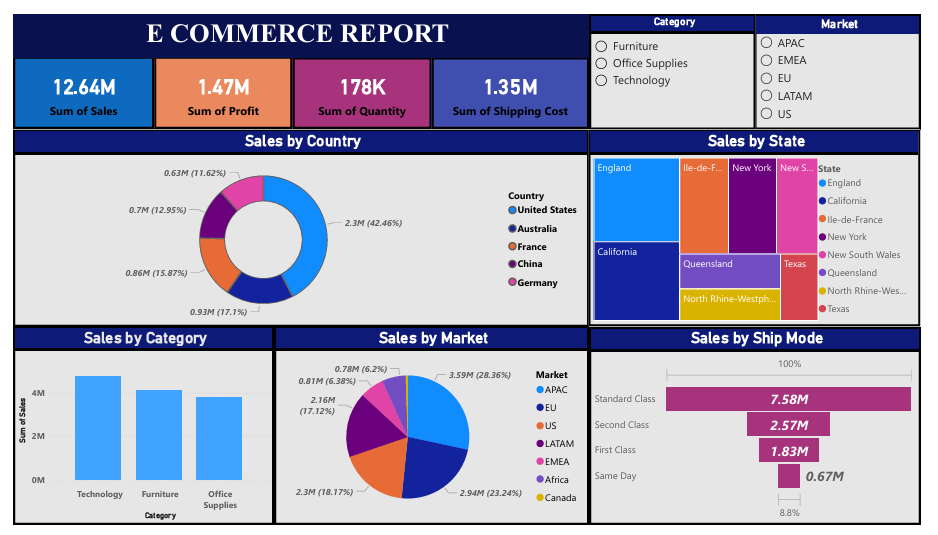

# E-Commerce Sales Dashboard | Power BI

## Overview
This project presents an interactive E-Commerce Sales Dashboard developed using Power BI to analyze sales performance, profit trends, shipping costs, and market-wise business insights.

The dashboard helps in understanding customer purchasing behavior, regional sales distribution, and operational performance through dynamic visualizations and filters.

---

## Dashboard Preview

---

## Key Metrics

- Total Sales: 12.64M
- Total Profit: 1.47M
- Total Quantity Sold: 178K
- Total Shipping Cost: 1.35M

---

## Features

- Interactive category and market filters
- Sales analysis by:
  - Country
  - State
  - Category
  - Market
  - Ship Mode
- KPI cards for quick business overview
- Dynamic and user-friendly visualizations

---

## Tools & Technologies Used

- Power BI
- DAX
- Data Visualization
- Data Cleaning
- Business Intelligence
- Power Query

---

## Business Insights

- Technology category generated the highest sales.
- Standard Class shipping mode contributed maximum orders.
- United States showed the highest sales contribution among countries.
- APAC and EU markets demonstrated strong revenue performance.

---

## Files Included

| File | Description |
|------|-------------|
| `.pbix` | Power BI Dashboard File |
| `Dataset` | Raw Dataset Used |
| `Screenshots` | Dashboard Preview Images |
| `README.md` | Project Documentation |

---

## Project Objective

To develop an interactive business intelligence dashboard capable of tracking sales performance, identifying profitable markets, and assisting data-driven decision-making.

---

## Author

Sejal Sahu
